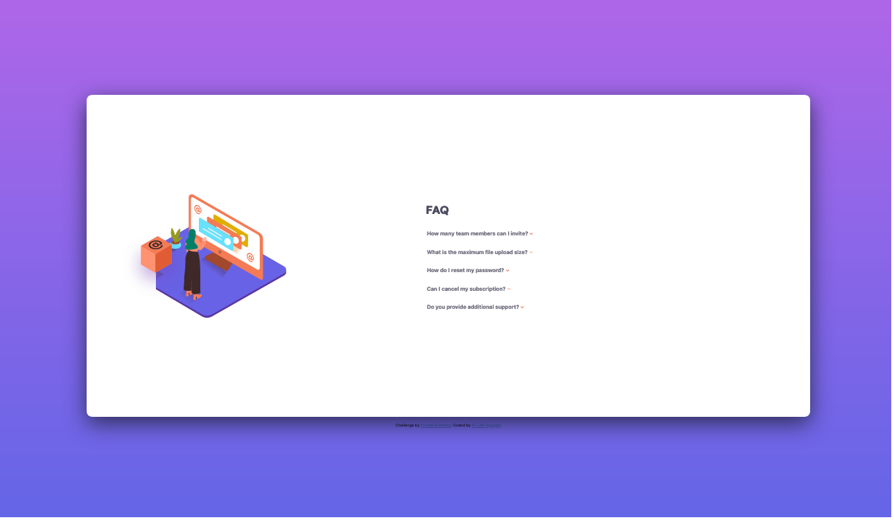
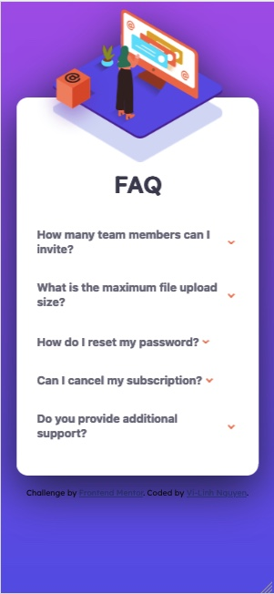

# Frontend Mentor - FAQ accordion card solution

This is a solution to the [FAQ accordion card challenge on Frontend Mentor](https://www.frontendmentor.io/challenges/faq-accordion-card-XlyjD0Oam). Frontend Mentor challenges help you improve your coding skills by building realistic projects.

## Table of contents

- [Overview](#overview)
  - [The challenge](#the-challenge)
  - [Screenshot](#screenshot)
  - [Links](#links)
- [My process](#my-process)
  - [Built with](#built-with)
  - [What I learned](#what-i-learned)
  - [Continued development](#continued-development)
  - [Useful resources](#useful-resources)
- [Author](#author)
- [Acknowledgments](#acknowledgments)

**Note: Delete this note and update the table of contents based on what sections you keep.**

## Overview

### The challenge

Users should be able to:

- View the optimal layout for the component depending on their device's screen size
- See hover states for all interactive elements on the page
- Hide/Show the answer to a question when the question is clicked

### Screenshot



The desktop view (1440px width) of the card. I had issues with the text width honestly. The image layering
was another problem encountered.



The mobile view (375px width) of the card. Adjusting the image to mobile view was annoying.

### Links

- Repository URL: [My repo](https://github.com/ViLinh27/faq-accordion-card-main)
- Live Site URL: [live site](https://vilinh27.github.io/faq-accordion-card-main/)

## My process

### Built with

- Flexbox
- Mobile-first workflow

### What I learned

The image formatting was the biggest obstacle in this challenge honestly. It was hard to figure out how to cut off the woman illustration correctly in desktop view and layer the box on top correctly. Plus in mobile view,
I wasn't too solid on how drop shadow filters but some fiddling helped me figure that out.

```html
<h1>Some HTML code I'm proud of</h1>

<!--panel 1-->
<button class="accordion">
  <h3>How many team members can I invite?</h3>
</button>

<div class="panel">
  <p>
    You can invite up to 2 additional users on the Free plan. There is no limit
    on team members for the Premium plan.
  </p>
</div>

<p>w3schools was a lifesaver in learning about how the accordion worked</p>
```

```css
.card {
  background-color: white;
  border-radius: 1rem;
  height: 60%;
  width: 80%;
  filter: drop-shadow(0px 20px 30px hsl(239, 31%, 27%));

  display: flex;
  flex-direction: row;
  justify-content: center;
  align-items: center;
  align-content: stretch;

  padding: 1rem;

  &__illustration {
    width: 45%;
    margin: 1rem 3rem 1rem 1rem;

    display: flex;
    flex-direction: row;
    justify-content: center;
    align-items: center;
    align-content: center;
  }

  &__text {
    width: 55%;
    margin: 1rem 1rem;
    color: hsl(237, 12%, 33%);
  }
}

.womanImg {
  position: absolute;
  margin-right: 16.5rem;
  z-index: 10;
  clip: rect(0rem, 100rem, 100rem, 6rem);
}

.accordion:after {
  /*down arrow*/
  content: image-set("../images/icon-arrow-down.svg");
  display: inline-block;
  margin: auto;
  padding: 5px;
}

.active:after {
  /*up arrow*/
  content: image-set("../images/icon-arrow-down.svg");
  display: inline-block;
  transform: rotate(180deg);
  /*
        Inline elements can't be transformed, and pseudo elements are inline by 
        default, so you must apply display: block or display: inline-block to 
        transform them
    */
}
```

If you want more help with writing markdown, we'd recommend checking out [The Markdown Guide](https://www.markdownguide.org/) to learn more.

**Note: Delete this note and the content within this section and replace with your own learnings.**

### Continued development

Use this section to outline areas that you want to continue focusing on in future projects. These could be concepts you're still not completely comfortable with or techniques you found useful that you want to refine and perfect.

**Note: Delete this note and the content within this section and replace with your own plans for continued development.**

### Useful resources

- [Example resource 1](https://www.example.com) - This helped me for XYZ reason. I really liked this pattern and will use it going forward.
- [Example resource 2](https://www.example.com) - This is an amazing article which helped me finally understand XYZ. I'd recommend it to anyone still learning this concept.

**Note: Delete this note and replace the list above with resources that helped you during the challenge. These could come in handy for anyone viewing your solution or for yourself when you look back on this project in the future.**

## Author

- Website - [Add your name here](https://www.your-site.com)
- Frontend Mentor - [@yourusername](https://www.frontendmentor.io/profile/yourusername)
- Twitter - [@yourusername](https://www.twitter.com/yourusername)

**Note: Delete this note and add/remove/edit lines above based on what links you'd like to share.**

## Acknowledgments

This is where you can give a hat tip to anyone who helped you out on this project. Perhaps you worked in a team or got some inspiration from someone else's solution. This is the perfect place to give them some credit.

**Note: Delete this note and edit this section's content as necessary. If you completed this challenge by yourself, feel free to delete this section entirely.**
